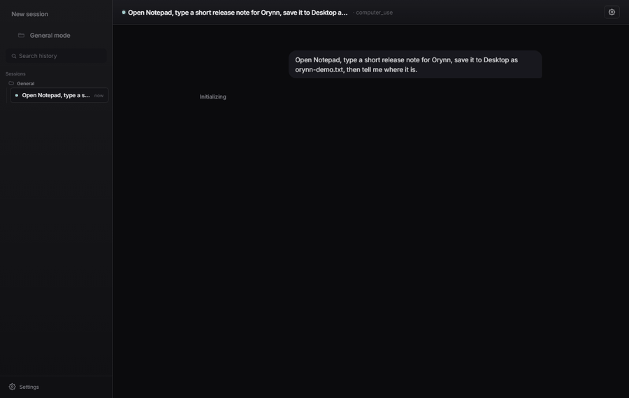

<div align="center">

# Orynn

**The AI agent that actually _uses_ your computer — by control name, not screenshots.**

[](https://github.com/robomohit/Orynn/actions/workflows/ci.yml)
[](https://github.com/robomohit/Orynn/releases)
[](LICENSE)
[](#requirements)
[](https://python.org/downloads)
[](https://github.com/robomohit/Orynn/stargazers)

[**Download**](https://github.com/robomohit/Orynn/releases) · [Quick Start](#quick-start-3-steps) · [Why Orynn?](#why-orynn) · [Demo Script](docs/DEMO_SCRIPT.md) · [Benchmarks](docs/BENCHMARKS.md) · [Roadmap](docs/ROADMAP.md)

</div>

> **An autonomous AI agent that controls your computer using plain English.** Give it a goal - it plans, acts, and shows you exactly what it is doing in real time, in a floating glass capsule that sits on top of your desktop.

<p align="center">
  
</p>

<p align="center"><sub>A real run: Orynn drives the Windows Calculator <b>by control name</b> (not screenshots, no pixel-clicks) to compute 2847 &times; 916 &mdash; on a free model.</sub></p>

> Free to run on [OpenRouter](https://openrouter.ai)'s free-tier models (subject to their limits). Coding and browser modes work on Windows, macOS, and Linux; native desktop control is Windows-only.

> **Security note:** Orynn is local automation software that can read local
> context, call external LLM providers, run code, browse the web, and control
> desktop apps when you allow it. Do not expose the dashboard to the public
> internet, never commit `.env`, and review sensitive actions before approval.
> See [SECURITY.md](SECURITY.md) before publishing or packaging it.

### What makes it different

Most computer-use agents take a **screenshot every step** and guess pixel coordinates - slow, expensive, and brittle. Orynn drives native Windows apps through **UI Automation**: it clicks controls **by name** (no screenshots, no pixel guessing), so it is faster, cheaper, and far more reliable. It only falls back to on-screen-text OCR, then pixels, when a control genuinely is not in the accessibility tree.

- **UIA-first desktop control** - drives Notepad, Excel, Word, Discord, Spotify, VS Code, and other Windows apps by control name.
- **Floating glass capsule** - frameless, translucent, always-on-top; press `Ctrl+Shift+Space` to summon it.
- **Runs free** - defaults to OpenRouter `:free` models end to end.
- **Uses your browser** - for web tasks (Gmail, Maps, GitHub, and more) it drives Chrome the way you would, with no extra accounts to connect.
- **Watch it work** - live action ticker and an aqua glow around the app it is touching.

## Why Orynn?

How it stacks up against the two common approaches - screenshot/pixel agents
and hosted cloud agents:

| | **Orynn** | Screenshot agents | Cloud agents |
|---|:---:|:---:|:---:|
| Desktop control | UIA control names (no screenshots) | pixel guessing from screenshots | screenshot streaming |
| Cost per step | Low (text only) | High (vision tokens) | High (vision tokens) |
| Runs 100% locally | Yes | Varies | No (hosted) |
| Free to run | Yes - OpenRouter `:free` | Varies | No |
| Floating always-on-top capsule | Yes | No | No |
| Coding + browser + desktop | All three | Usually one | Varies |
| Provider-agnostic | OpenRouter / OpenAI / Anthropic / Gemini / Groq / Ollama | Varies | Locked to vendor |
| Permission scopes + approval gates | Yes | Rarely | Varies |

---

### Privacy and control

Orynn is designed for local, inspectable automation rather than a hosted
black box. It still calls whichever LLM provider you configure, so read your
provider's data policy before pasting sensitive data, but the app itself gives
you these controls:

- **Permission scopes per task** - browser, filesystem, shell, screen,
  clipboard, system, and MCP access are tracked separately.
- **Approval gates for risky actions** - shell commands, file writes, process
  termination, dynamic MCP tools, and other high-risk actions pause for review.
- **Untrusted-content boundaries** - web pages, snippets, and accessibility
  trees are wrapped as untrusted input before they reach the model.
- **Local auth by default** - the local API uses bearer auth and the dashboard
  is intended for localhost or trusted private networks only.
- **Stop control** - running tasks can be killed from the UI when you need to
  take back the wheel.

---

## Requirements

- **Windows 10 / 11** for the floating capsule and native desktop control. macOS/Linux get coding and browser modes via the web dashboard.
- **Python 3.10 or newer** - [python.org/downloads](https://python.org/downloads) (tick *"Add python.exe to PATH"* during install).
- One LLM API key - a **free** OpenRouter key is all you need.

---

## Download

**Prefer a one-click app?** Grab the latest prebuilt Windows bundle from the
**[Releases page](https://github.com/robomohit/Orynn/releases)** - no Python
required, just unzip and run `Orynn.exe`. (Built automatically on every version
tag; see [PACKAGING.md](PACKAGING.md).)

Otherwise, run from source in 3 steps below.

---

## Quick Start (3 steps)

### 1. Clone and setup

**Windows** - double-click `setup.bat`, or run in terminal:

```cmd
git clone https://github.com/robomohit/Orynn.git
cd Orynn
setup.bat
```

**Mac / Linux:**

```bash
git clone https://github.com/robomohit/Orynn.git
cd Orynn
chmod +x setup.sh && ./setup.sh
```

### 2. Add your API key

Open `.env` and paste in **at least one** key - both have free tiers:

```env
OPENROUTER_API_KEY=sk-or-v1-...   # free - widest model selection
GROQ_API_KEY=gsk_...              # free - dramatically faster (sub-second) responses
```

> Get a free OpenRouter key at [openrouter.ai/keys](https://openrouter.ai/keys), or a
> free Groq key at [console.groq.com/keys](https://console.groq.com/keys). **Best results:
> set both.** Orynn uses Groq for its sub-second speed and **automatically falls back to
> OpenRouter's free models if Groq is busy** — so you get fast *and* reliable. With only
> one key it uses that provider. All free tiers carry the provider's own rate limits.

### 3. Launch

Two native desktop surfaces (no browser needed):

- **`start.bat`** - the floating glass **capsule** (the main product). Press **`Ctrl+Shift+Space`** any time to show/hide it.
- **`start_dashboard.bat`** - the full **dashboard** in its own native window (sessions, models, MCP, skills).

> Advanced: `start_web.bat` serves the dashboard over HTTP (http://localhost:8080) for a browser or another device.

---

## Modes

| Mode | What it does |
|---|---|
| **Coding** | Writes, edits, and runs code. No screenshots - fast and accurate. |
| **Browser** | Controls a headless Chrome browser via the accessibility tree. Fills forms, navigates sites, reads pages. |
| **Desktop** | Drives native and Electron apps (Notepad, Discord, VS Code, Spotify, and more) through **Windows UI Automation** by control name. It avoids screenshots and pixel guessing unless the accessibility tree cannot expose the target. |

The mode is **auto-detected** from your goal, or you can pick it manually.

---

## The floating capsule (main product)

`start.bat` launches the native glass capsule (`run_desktop.py`) - a frameless,
translucent, always-on-top window with real Windows Acrylic blur that adapts to
light/dark backdrops. Type a goal, watch the agent work with a live action
ticker and an aqua glow around the target app.

```bash
# Manual launch / dashboard window:
python run_desktop.py              # floating capsule
python run_desktop.py --dashboard  # full dashboard in a native window
```

> Desktop control (UI Automation) is **Windows-only**. Coding and browser modes
> run on Windows, macOS, and Linux via the web dashboard (`start_web.bat`).

---

## Semantic Memory (optional)

For richer memory that uses vector search instead of keyword matching:

```bash
pip install -r requirements-memory.txt
```

Then add to `.env`:

```env
USE_CHROMA=1
```

---

## API Keys

| Variable | Provider | Cost |
|---|---|---|
| `OPENROUTER_API_KEY` | OpenRouter | Free tier available |
| `ANTHROPIC_API_KEY` | Claude (Anthropic) | Paid |
| `OPENAI_API_KEY` | GPT-4o (OpenAI) | Paid |
| `GOOGLE_API_KEY` | Gemini (Google) | Paid |
| `GROQ_API_KEY` | Llama (Groq) | Free tier available |
| `AGENT_API_KEY` | Internal auth | Auto-generated if blank |

### Desktop reliability (optional)

Desktop control runs on the **free** UIA tier by default. The free models are
fast and handle single/moderate tasks well, but can derail on long multi-step
sequences. For maximum reliability, opt in to a stronger model **for desktop
tasks only** - free stays the default everywhere else:

```bash
DESKTOP_MODEL=claude-3-5-sonnet-20241022   # or gpt-4o, or any OpenRouter id
```

Leave it blank to stay fully free.

---

## Keyboard Shortcuts

| Key | Action |
|---|---|
| `Enter` | Send task |
| `Shift+Enter` | New line |
| `Ctrl+K` | Command palette |
| `Space` | Pause / resume |
| `Esc` | Close modal |

---

## Docker

```bash
docker-compose up --build
```

---

## Architecture

```text
Capsule / Dashboard (PySide6 + pywebview)
   |
   | SSE (live action stream)
   v
FastAPI (app/main.py)
   |
   +-- AgentService (app/agent.py)
       +-- Providers -> OpenRouter / OpenAI / Anthropic / other model providers
       +-- ToolExecutor -> shell / files / browser / UIA desktop (app/tools.py)
       |   +-- Hybrid resolver: UIA control -> on-screen-text OCR -> pixel
       +-- SafetyManager -> blocks dangerous / irreversible actions
       +-- LogEmitter -> streams every step to the UI
```

---

## Troubleshooting

| Problem | Fix |
|---|---|
| `Python not found` when running `setup.bat` | Install Python 3.10+ from [python.org](https://python.org/downloads) and tick **"Add python.exe to PATH"**, then reopen the terminal. |
| Capsule does not appear after `start.bat` | It is always-on-top but may be behind a fullscreen window - press **`Ctrl+Shift+Space`** to summon it. |
| "No API key" on first run | Paste a free OpenRouter key when prompted (get one at [openrouter.ai/keys](https://openrouter.ai/keys)), or add `OPENROUTER_API_KEY=` to `.env`. |
| Browser mode does nothing | Run `python -m playwright install chromium` to fetch the browser. |
| Desktop agent cannot find a control | Make sure the target app is open and focused; for Electron apps (Discord, Slack, and similar apps) it auto-unlocks accessibility, which may need the app restarted once. |
| Rate-limited / model busy | Free OpenRouter models have shared limits - wait a moment, or set `DESKTOP_MODEL` / a paid key for headroom. |

---

## Contributing

Issues and PRs are welcome - see **[CONTRIBUTING.md](CONTRIBUTING.md)** for the
full guide. In short, run the test suite before submitting (CI runs it on Windows
and Ubuntu for every PR):

```bash
python -m pytest -q
```

---

## License

**[PolyForm Noncommercial 1.0.0](LICENSE)** (c) [robomohit](https://github.com/robomohit)

Free to use, modify, and share for **any noncommercial purpose** - personal projects, study, research, hobby use, and nonprofits/education/government. **Commercial use is not permitted** under this license; for a commercial license, contact the author.

> This is a *source-available* license, not OSI "open source." You can read and learn from the code, but you may not ship it (or a derivative) commercially without a separate agreement. *Not legal advice - consult a lawyer for specifics.*
